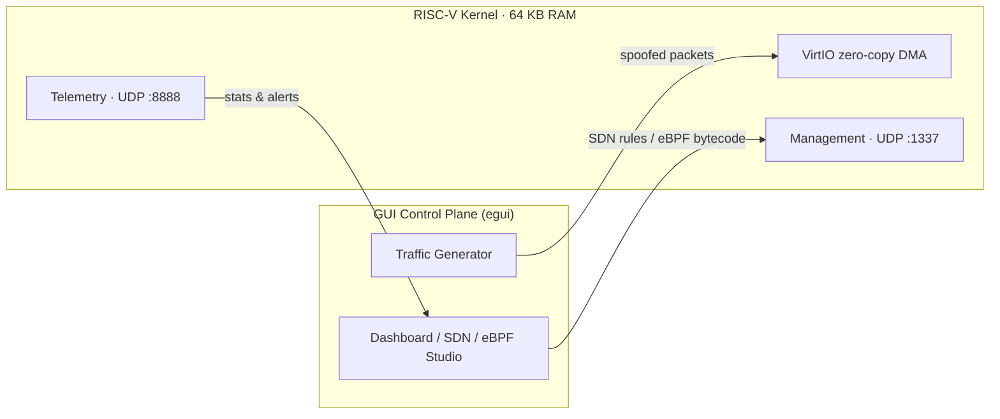
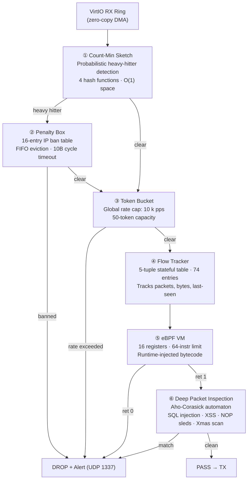
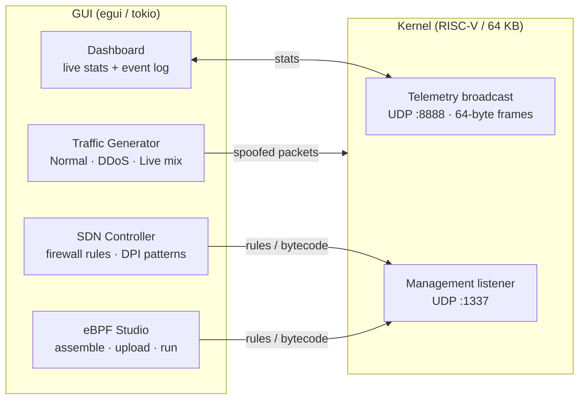

# RISC-V Security Unikernel

A bare-metal **network security appliance** written in Rust, running in Ring 0 on RISC-V without a host OS. The entire system — stateful firewall, DDoS mitigation, deep packet inspection, and a programmable eBPF VM — is engineered to fit within a strict **64 KB RAM** constraint.



---

## The 64 KB Engineering Challenge

Fitting a production-grade security stack into 64 KB requires every byte to be justified:

| Structure | Size | Technique |
|---|---|---|
| Count-Min Sketch (DDoS) | 1,024 B | 4 × 128 × u16 — probabilistic heavy-hitter detection |
| Flow table (74 entries) | ~3.5 KB | Packed 5-tuple structs, LRU eviction |
| Aho-Corasick DFA | ~1.5 KB | 128-node trie for multi-pattern payload scan |
| VirtIO DMA buffers | 3 KB | Tuned to exact Ethernet MTU (1536 B each) |
| eBPF program slot | 448 B | 64 instructions × 7 bytes |
| Penalty box | 256 B | 16-entry FIFO ban table |
| **Hot path allocations** | **0 B** | Zero heap use; all structures statically allocated |

---

## Packet Processing Pipeline



---

## Security Mechanisms

### Count-Min Sketch — DDoS Detection
Tracks packets-per-source-IP using four independent hash functions over a 4×128 counter matrix. The minimum of all four counters gives a probabilistic frequency estimate — no per-IP state needed. Heavy hitters (>100 pps) are evicted to the Penalty Box. Resets every ~1B cycles to drain stale flows.

### Aho-Corasick DPI Engine
Single-pass payload scanner with failure links — detects all patterns simultaneously in O(n) time regardless of how many signatures are loaded. Built-in patterns: `DROP TABLE`, `<script>`, `eval(`, `UNION SELECT`. Additional signatures injected at runtime via UDP management commands without rebooting.

### eBPF Virtual Machine
A custom 16-register bytecode VM. Supports load, move, compare, bitwise, and conditional jump opcodes. Programs are uploaded at runtime through the GUI's eBPF Studio. A 1,000-cycle hard limit prevents runaway filters from stalling the packet loop.

### Heuristic Engine
Detects TCP Xmas scans (FIN|URG|PSH), null scans (no flags), and NOP sleds (four consecutive `0x90` bytes) — catches port-scanning tools and shellcode-carrying payloads that signature matching would miss.

---

## Control Plane (GUI)

A companion desktop application (`egui`/`eframe`) communicates with the kernel over a custom binary UDP protocol on port 1337.



**Telemetry frame (64 bytes):** passed/DDoS-drop/firewall-block/malware-detect/eBPF-reject/heuristic-reject/RAM-used/active-flows — all as big-endian u64.

**Traffic modes:** Normal (80–120 pps), DDoS (1,200 pps from 50 bot IPs), Live (mixed HTTP + periodic injection bursts).

---

## Technical Specifications

| Property | Value |
|---|---|
| Target ISA | RV64GC (`riscv64gc-unknown-none-elf`) |
| RAM budget | 64 KB |
| Language | Rust `no_std` / `no_main` |
| Network driver | VirtIO-Net legacy, zero-copy DMA |
| Concurrency model | Single-threaded polling loop |
| Build profile | `-Oz`, LTO, `codegen-units=1`, stripped |
| Static footprint | 64,400 / 65,536 bytes (98.3% of budget) |

---

## Benchmarks

The pure-logic security modules are benchmarked on the host with [Criterion](https://github.com/bheisler/criterion.rs). No QEMU required.

```bash
make bench
```

| Benchmark | Median |
|---|---|
| `cms_insert` (single IP) | 7.8 ns |
| `cms_insert_64_ips` (varied) | 8.1 ns |
| `ac_scan_clean_payload` (128 B, no match) | 162 ns |
| `ac_scan_matching_payload` (early match) | 103 ns |
| `vm_execute_6_instructions` | 4.4 ns |
| `flow_update_new_flow` | ~125 ns |
| `flow_update_existing_flow` | 3.4 ns |
| `flow_update_full_table_74_flows` | 42.9 ns |
| `heuristic_check_tcp_flags` | 0.7 ns |
| `heuristic_check_payload_clean` | 26.4 ns |
| `heuristic_check_payload_nop_sled` | 2.4 ns |
| **full hot path** (CMS + AC + VM, per packet) | **176 ns** |

The full hot path (CMS → Aho-Corasick DPI → eBPF VM) runs in ~176 ns per packet on a modern x86 host, equivalent to >5 million packets/second through the security stack.

---

## Size Guarantee

```bash
make check-size
```

Measures `.text + .rodata + .data + .bss` and fails the build if the total exceeds the 64 KB RAM budget. Run after any change to verify the constraint holds.

---

## Running

**Requirements:** Rust nightly · `qemu-system-riscv64` · `iproute2` · `make`

```bash
# Build kernel + configure TAP interface + launch QEMU
make run

# Launch GUI (separate terminal)
make gui
```

1. In the GUI, open the **Traffic Generator** tab and click **Start Normal** or **Start DDoS**
2. Watch the **Dashboard** for live throughput, drop reasons, and flow counts
3. Use the **SDN** tab to inject firewall rules or DPI signatures at runtime
4. Use the **eBPF Studio** to write and upload custom bytecode filters

Press `Ctrl+A X` to exit QEMU.
